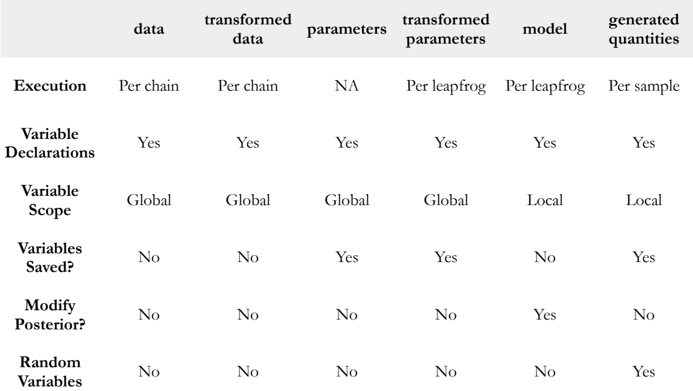

```{r setup, include=FALSE}
## --- learnr ---
if ("learnr" %in% (.packages()))
  detach(package:learnr, unload = TRUE)
library(learnr)
knitr::opts_chunk$set(echo = FALSE)

## ---- CRAN Packages ----
## Save package names as a vector of strings
pkgs <-  c("rstan", "rstantools", "coda", "dplyr")

## Install uninstalled packages
lapply(pkgs[!(pkgs %in% installed.packages())], 
       install.packages,
       repos='http://cran.us.r-project.org')

## Load all packages to library and adjust options
lapply(pkgs, library, character.only = TRUE)

## ---- GitHub Packages ----


## ---- Global learnr Objects ----
load(url("https://github.com/denis-cohen/statmodeling/raw/main/data/lm_stan.RData"))

## ---- rstan Options ----
rstan_options(auto_write = TRUE)             # avoid recompilation of models
options(mc.cores = parallel::detectCores())  # parallelize across all CPUs
```

## Stan

### What is Stan?

In the words of the developers:

<blockquote>
"Stan is a state-of-the-art platform for statistical modeling and high-performance statistical computation. Thousands of users rely on Stan for statistical modeling, data analysis, and prediction in the social, biological, and physical sciences, engineering, and business.
  
Users specify log density functions in Stan's probabilistic programming language and get:
  
- full Bayesian statistical inference with MCMC sampling (NUTS, HMC)
- approximate Bayesian inference with variational inference (ADVI)
- penalized maximum likelihood estimation with optimization (L-BFGS)
  
</blockquote>

<div style="text-align: right"> 
  <sub><sup>
    Source: https://mc-stan.org/ 
  </sub></sup>
</div>


### Why Stan?

- Open-source software
- Fast and stable algorithms
- High flexibility with few limitations
- Extensive documentation
    - [User's Guide](https://mc-stan.org/docs/2_19/stan-users-guide/index.html)
    - [Language Reference Manual](https://mc-stan.org/docs/2_19/reference-manual/index.html)
    - [Language Functions Reference](https://mc-stan.org/docs/2_19/functions-reference/index.html)
- Highly transparent development process; see [Stan Development Repository on Github](https://github.com/stan-dev/stan)
- Very responsive [Development Team](https://mc-stan.org/about/team/)
- Large and active community in the [Stan Forums](https://discourse.mc-stan.org/) and [Stack OVerflow](https://stackoverflow.com/questions/tagged/stan)
- Increasing number of [case studies](https://mc-stan.org/users/documentation/case-studies.html), [tutorials](https://mc-stan.org/users/documentation/tutorials.html), [papers and textbooks](https://mc-stan.org/users/documentation/external.html)
- Compatibility with various editor for syntax highlighting, formatting, and checking (incl. [RStudio](https://www.rstudio.com/) and [Emacs](https://www.gnu.org/software/emacs/))

### Stan interfaces

- RStan (R)
- PyStan (Python)
- CmdStan (shell, command-line terminal)
- MatlabStan (MATLAB)
- Stan.jl (Julia)
- StataStan (Stata)
- MathematicaStan (Mathematica)
- ScalaStan (Scala)

### (Some) R packages

- [**rstan**](https://cran.r-project.org/package=rstan): General R Interface to Stan
- [**shinystan**](https://cran.r-project.org/package=shinystan): Interactive Visual and Numerical Diagnostics and Posterior Analysis for Bayesian Models
- [**bayesplot**](https://cran.r-project.org/web/packages/bayesplot/index.html): Plotting functions for posterior analysis, model checking, and MCMC diagnostics.
- [**brms**](https://cran.r-project.org/package=brms): Bayesian Regression Models using 'Stan', covering a growing number of model types
- [**rstanarm**](https://cran.r-project.org/package=rstanarm): Bayesian Applied Regression Modeling via Stan, with an emphasis on hierarchical/multilevel models
- [**edstan**](https://cran.r-project.org/package=edstan): Stan Models for Item Response Theory
- [**rstantools**](https://cran.r-project.org/package=rstantools): Tools for Developing R Packages Interfacing with 'Stan'

### Caveat: Reproducibility 

Under what conditions are estimates reproducible? See [Stan Reference Manual](https://mc-stan.org/docs/2_19/reference-manual/reproducibility-chapter.html), Section 19:

- Stan version
- Stan interface (RStan, PyStan, CmdStan) and version, plus version of interface language (R, Python, shell)
- versions of included libraries (Boost and Eigen)
- operating system version
- computer hardware including CPU, motherboard and memory
- C++ compiler, including version, compiler flags, and linked libraries
- same configuration of call to Stan, including random seed, chain ID, initialization and data

## Bayesian workflow

### A quick overview

#### The short version

1. **Specification**: Specify the full probability model
    - data
    - likelihood
    - priors
2. **Model Building**: Translate the model into code
3. **Validation**: Validate the model with fake data
4. **Fitting**: Fit the model to actual data
5. **Diagnosis**: Check generic and algorithm-specific diagnostics to assess convergence
6. Posterior Predictive Checks
7. Model Comparison

<div style="text-align: right"> 
  <sub><sup>
    Source: [Jim Savage (2016) A quick-start introduction to Stan for economists. A QuantEcon Notebook.](http://nbviewer.jupyter.org/github/QuantEcon/QuantEcon.notebooks/blob/master/IntroToStan_basics_workflow.ipynb)
  </sub></sup>
</div>

#### The long version

```{r workflow, exercise = FALSE, echo = FALSE, out.width = '90%', fig.align="center"}
knitr::include_graphics("images/workflow.png")
```

<div style="text-align: right"> 
  <sub><sup>
    Source: [Gelman, A., Vehtari, A., Simpson, D., Margossian, C. C., Carpenter, B., Yao, Y., Kennedy, L., Gabry, J., Bürkner, P. C., & Modrák, M. (2020). Bayesian workflow.](https://arxiv.org/abs/2011.01808)
  </sub></sup>
</div>


## Specification (linear model)

### Reminder: Equivalent notations

1. Scalar form: $$y_i = \beta_1 x_{i1} + \beta_2 x_{i2} + \beta_3 x_{i3} + \epsilon_i \text{ for all } i=1,...,N$$
2. Row-vector form: $$y_i = \mathbf{x_i^{\prime}} \mathbf{\beta} + \epsilon_i  \text{ for all } i=1,...,N$$
3. Column-vector form: $$\mathbf{y} = \beta_1 \mathbf{x_{1}} + \beta_2 \mathbf{x_{2}} + \beta_3 \mathbf{x_{3}} \mathbf{\epsilon}$$
4. Matrix form: $$\mathbf{y = X \beta + \epsilon}$$
	
### Example: Linear model

Our knowledge of generalized linear models gives us *almost everything we need!

#### Probability model for the data

First, let's recap the three parts of every GLM in the context of the linear model:

* Family: $\mathbf{y} \sim \text{Normal}(\mu, \sigma)$
* (Inverse) link function: $\mathbf{y^{\ast}} = \text{id}(\mu) = \mu$
* Linear component: $\mu = \mathbf{X} \beta$

The *family* specifies the probability model (a.k.a. likelihood, data-generating process, or generative model) for the *data*: The fundamental assumption of the linear model is that every observation $y_i$ is a realization from a normal pdf with location parameter (mean) $\mu_i$ and constant scale parameter (variance) $\sigma^2$.

*Note:* Mimicking the convention in both R and Stan, we parameterize the normal distribution in terms of its mean and *standard deviation* (not variance)!

#### Known and unknown quantities

* Parameters (unknown, random quantities):
    * $\beta$, the coefficient vector
    * $\sigma$, the scale parameter of the normal
    * $\mu$, the location parameter of the normal
* Data (known, fixed quantities):
    * $\mathbf{y}$, the outcome vector
    * $\mathbf{X}$, the design matrix
    * the dimensions of $\mathbf{y}_{N \times 1}$ and $\mathbf{X}_{N \times K}$
    * the dimensions of $\beta_{K \times 1}$, $\sigma$ (a scalar), and $\mu_{N \times 1}$
    
#### Priors

What is still missing are prior distributions for the unknown quantities.

Here, we have quite some discretion. There are few rules we must adhere to:

- Our $\beta$'s have unconstrained support (though by far not all value ranges may be reasonable!)
- The scale parameter $sigma$ cannot be negative

Here, we will opt for a convenience solution and specify weakly informative zero-mean normal priors for the $\beta$'s and a weakly informative half-Cauchy prior for $\sigma$:

- $\beta \sim \text{N}(0, 10)$
- $\sigma \sim \text{Cauchy}^{+}(0, 5)$

```{r prior-viz, fig.align = "center", include = TRUE}
b <- seq(-50, 50, .1)
s <- seq(0, 50, .1)
b_pdf <- dnorm(b, mean = 0, sd = 10)
s_pdf <- dcauchy(s, location = 0, scale = 5)
par(mfrow = c(1, 2))
plot(
  b,
  b_pdf,
  type = 'l',
  xlab = bquote(beta[k]),
  ylab = bquote("p(" ~ beta[k] ~ ")"),
  main = bquote("Prior distribution of " ~ beta[k])
)
polygon(
  c(b, rev(b)),
  c(rep(0, length(b_pdf)), rev(b_pdf)),
  col = adjustcolor("gray50", alpha.f = 0.25),
  border = NA
)
plot(
  s,
  s_pdf,
  type = 'l',
  xlab = bquote(sigma),
  ylab = bquote("p(" ~ sigma ~ ")"),
  main = bquote("Prior distribution of " ~ sigma)
)
polygon(
  c(s, rev(s)),
  c(rep(0, length(s_pdf)), rev(s_pdf)),
  col = adjustcolor("gray50", alpha.f = 0.25),
  border = NA
)
```


## Model building

#### Stan Program Blocks

1. Functions: Declare user written functions
2. **Data**: Declare all known quantities
3. Transformed Data: Transform declared data inputs (once)
4. **Parameters**: Declare all unknown quantities
5. Transformed Parameters: Transform declared parameters (each step, each iteration)
6. **Model**: Transform parameters, specify prior distributions and likelihoods
7. Generated Quantities (each iteration)

#### Program Blocks

```{r blocks, exercise = FALSE, echo = FALSE, out.width = '72%', fig.align="center"}

```

<br>
<div style="text-align: right">
  <sub><sup>
    Source: http://mlss2014.hiit.fi/mlss_files/2-stan.pdf
  </sub></sup>
</div>

#### Script for a Stan program

*Writing scripts for Stan programs*

- Start with a blank script in your preferred code editor and save it as "lm.stan" .
- This will enable syntax highlighting, formatting, and checking in RStudio and Emacs.
- Alternatively, you can save your model as a single character string in R (with some drawbacks).

*Style guide*

- There is a [style guide](https://mc-stan.org/docs/2_26/stan-users-guide/stan-program-style-guide.html). Some recommendations:
    - consistency
    - lines should not exceed 80 characters
    - lowercase variables, words separated by underscores
    - like R: space around operators: `y ~ normal(...)`, `x = (1 + 2) * 3`
    - spaces after commas are optional: `y[m,n] ~ normal(0,1)` or `y[m, n] ~ normal(0, 1)`
- Always make sure to end your script with a blank line.
- You must use a delimiter to finish lines: `;`.
- `// this is a comment`


#### Data block

Declare all known quantities, including data types, dimensions, and constraints: 

- $\mathbf{y}_{N \times 1}$
- $\mathbf{X}_{N \times K}$

```{stan ex1-data1, output.var = "none", exercise = TRUE}
data {
  int<lower=1> N; // num. observations
  ... declarations ...
}
```


```{stan ex1-data1-solution, output.var = "none"}
data {
  int<lower=1> N; // num. observations
  int<lower=1> K; // num. predictors
  matrix[N, K] x; // model matrix
  vector[N] y;    // outcome vector
}
```

#### Parameters block

Declare unknown 'base' quantities, including storage types, dimensions, and constraints: 

- $\beta$, the coefficient vector
- $\sigma$, the scale parameter of the normal

```{stan ex1-pars1, output.var = "none", exercise = TRUE}
parameters {
  ... declarations ...
}
```


```{stan ex1-pars1-solution, output.var = "none"}
parameters {
  vector[K] beta;      // coef vector
  real<lower=0> sigma; // scale parameter
}
```

#### Transformed parameters block

Declare and specify unknown transformed quantities, including storage types, dimensions, and constraints: 

- $\mu = \mathbf{X} \beta$, the linear prediction


```{stan ex1-tpars1, output.var = "none", exercise = TRUE}
transformed parameters {
  ... declarations ... statements ....
}
```


```{stan ex1-tpars1-solution, output.var = "none"}
transformed parameters {
  vector[N] mu;  // declare
  mu = x * beta; // assign
}
```

#### Model block

Declare and specify local variables (optional) and specify sampling statements:

- $\beta_k \sim \text{Normal}(0, 10) \text{ for k = 1,...,K}$ 
- $\sigma \sim \text{Cauchy}^{+}(0, 5)$
- $\mathbf{y} \sim \text{Normal}(\mu, \sigma)$

```{stan ex1-mod1, output.var = "none", exercise = TRUE}
model {
  // priors
  ... statements ...
  
  // log-likelihood
  ... statements ...
}
```

```{stan ex1-mod1-solution, output.var = "none"}
model {
  // priors
  target += normal_lpdf(beta | 0, 10);  // priors for beta
  target += cauchy_lpdf(sigma | 0, 5);  // prior for sigma
  
  // log-likelihood
  target += normal_lpdf(y | mu, sigma); // likelihood
}
```

### Writing Stan programs in R

- You can supply Stan programs as a character string in R
- Downsides:
    - No syntax highlighting, formatting, and checking
    - Must use double quotation marks `"` around the strong to avoid that the [transposition operator](https://mc-stan.org/docs/2_26/functions-reference/transposition-operator.html) `'` breaks the string
- Upsides: Works with the interactive `learnr` tutorials in our workshop!

```{r ex1-full, exercise = TRUE}
# Save as character
lm_code <- 
"data {
  int<lower=1> N; // num. observations
  int<lower=1> K; // num. predictors
  matrix[N, K] x; // design matrix
  vector[N] y;    // outcome vector
}

parameters {
  vector[K] beta;      // coef vector
  real<lower=0> sigma; // scale parameter
}

transformed parameters {
  vector[N] mu;  // declare lin. pred.
  mu = x * beta; // assign lin. pred.
}

model {
  // priors
  target += normal_lpdf(beta | 0, 10);  // priors for beta
  target += cauchy_lpdf(sigma | 0, 5);  // prior for sigma
  
  // log-likelihood
  target += normal_lpdf(y | mu, sigma); // likelihood
}"

# Write to script
writeLines(lm_code, con = "lm.stan")
```

## Validation

### Simulate the data-generating process in R

```{r inf-sim1, exercise=TRUE}
# Set seed
set.seed(20210329)

# Simulate data
N <- 1000L                                # num. observations
K <- 5L                                   # num. predictors
x <- cbind(                               # design matrix
  rep(1, N), 
  matrix(rnorm(N * (K - 1)), N, (K - 1))
  )

# Simulate parameters
beta <- rnorm(K, 0, 1)                    # coef. vector
sigma <- 2.5                              # scale parameter

# Get transformed parameters
mu <- x %*% beta                          # linear prediction

# Simulate outcome variable
y_sim <- rnorm(N, mu, sigma)              # simulated outcome
```

### Setup and compilation

```{r inf-setup, exercise = TRUE}
## Setup
library(rstan)
rstan_options(auto_write = TRUE)             # avoid recompilation of models
options(mc.cores = parallel::detectCores())  # parallelize across all CPUs

## Data as list
standat_val <- list(
  N = N,
  K = K,
  x = x,
  y = y_sim
)

## C++ Compilation
lm_mod <- rstan::stan_model(model_code = lm_code)
```

### Estimation

```{r inf-sampl, exercise = TRUE}
lm_val <- rstan::sampling(
  lm_mod,                     # compiled model
  data = standat_val,             # data input
  algorithm = "NUTS",         # algorithm
  control = list(             # control arguments
    adapt_delta = .85),
  save_warmup = FALSE,        # discard warmup sims
  sample_file = NULL,         # no sample file
  diagnostic_file = NULL,     # no diagnostic file
  pars = c("beta", "sigma"),  # select parameters
  iter = 2000L,               # iter per chain
  warmup = 1000L,             # warmup period
  thin = 2L,                  # thinning factor
  chains = 2L,                # num. chains
  cores = 2L,                 # num. cores
  seed = 20210329)            # seed
```

### Output summary

*Reminder:* Here are the 'true' parameter values:

```{r inf-out1, exercise = TRUE}
true_pars <- c(beta, sigma)
names(true_pars) <- c(paste0("beta[", 1:5, "]"), "sigma")
true_pars
```

And here are the estimates from our model:

```{r inf-out2, exercise = TRUE}
lm_val
```

- When comparing these estimates, the question is, of course, how much deviation should have us worried.
- Deviations from a single validation run may be due to a circumstantial selection of extreme ‘true’ parameter values when simulating the data generating process. 
- [Cook, Gelman, and Rubin (2006)](https://www.tandfonline.com/doi/abs/10.1198/106186006X136976) thus recommend running many replications of such validation simulations.
- They also provide a useful test statistic.


### A stanfit object

```{r inf-out3, exercise = TRUE}
str(lm_val)
```

## Inference

For the sake of illustration, we use the replication data from Bischof and Wagner (2019), made available through the [American Journal of Political Science Dataverse](https://doi.org/10.7910/DVN/DZ1NFG). 

The original analysis uses Ordinary Least Squares estimation to gauge the effect of the assassination of the populist radical right politician Pim Fortuyn prior to the Dutch Parliamentary Election in 2002 on micro-level ideological polarization. 

The outcome variable contains squared distances of respondents' left-right self-placement to the pre-election median self-placement of all respondents. The main predictor is a binary indicator whether the interview was conducted before or after Fortuyn's assassination. 

### Getting actual data

```{r inf-dat, exercise = TRUE}
## Retrieve and manage data
bw_ajps19 <-
  read.table(
    paste0(
      "https://dataverse.harvard.edu/api/access/datafile/",
      ":persistentId?persistentId=doi:10.7910/DVN/DZ1NFG/LFX4A9"
    ),
    header = TRUE,
    stringsAsFactors = FALSE,
    sep = "\t",
    fill = TRUE
  ) %>% 
  select(wave, fortuyn, polarization) %>% ### select relevant variables
  subset(wave == 1) %>%                   ### subset to pre-election wave
  na.omit()                               ### drop incomplete rows

## Define data
x <- model.matrix(~ fortuyn, data = bw_ajps19)
y <- bw_ajps19$polarization
N <- nrow(x)
K <- ncol(x)

## Collect as list
standat_inf <- list(
  N = N,
  K = K,
  x = x,
  y = y)
```

### Inference

```{r inf-real, exercise = TRUE}
lm_inf <- rstan::sampling(
  lm_mod,                     # compiled model
  data = standat_inf,             # data input
  algorithm = "NUTS",         # algorithm
  control = list(             # control arguments
    adapt_delta = .85),
  save_warmup = FALSE,        # discard warmup sims
  sample_file = NULL,         # no sample file
  diagnostic_file = NULL,     # no diagnostic file
  pars = c("beta", "sigma"),  # select parameters
  iter = 2000L,               # iter per chain
  warmup = 1000L,             # warmup period
  thin = 2L,                  # thinning factor
  chains = 2L,                # num. chains
  cores = 2L,                 # num. cores
  seed = 20210329)            # seed
```

### Posterior summaries

The original analysis reports point estimates (standard errors) of 1.644 (0.036) for the intercept and -0.112 (0.076) for the before-/after indicator.

How do our estimates compare?

#### Model summary

```{r inf-sum, exercise = TRUE}
print(lm_inf,
      pars = c("beta", "sigma"),
      digits_summary = 3L)
```

#### Hypothesis testing

```{r inf-prob, echo = TRUE}
# Extract posterior samples for beta[2]
beta2_posterior <- rstan::extract(lm_inf)$beta[, 2]

# Probability that beta[2] is greater than zero
mean(beta2_posterior > 0)
```

## Convergence diagnostics

### Generic diagnostics: `Rhat` and `n_eff`

1. $\hat{R} < 1.1$: Potential scale reduction statistic (aka Gelman-Rubin convergence diagnostic) 
    - low values indicate that chains are stationary (convergence to target distribution within chains)
    - low values indicate that chains mix (convergence to same target distribution across chains)
1. $\frac{\mathtt{n_{eff}}}{\mathtt{n_{iter}}} > 0.001$: Effective sample  size
    - A small effective sample size indicates high autocorrelation within chains
    - This indicates that chains explore the posterior density very slowly and inefficiently

### Algorithm-specific diagnostics

In the words of the developers:

<blockquote>
"Hamiltonian Monte Carlo provides not only state-of-the-art sampling speed, it also provides state-of-the-art diagnostics. Unlike other algorithms, when Hamiltonian Monte Carlo fails it fails sufficiently spectacularly that we can easily identify the problems."
</blockquote>

<div style="text-align: right"> 
  <sub><sup>
    Source: https://github.com/stan-dev/stan/wiki/Stan-Best-Practices 
  </sub></sup>
</div>

- Divergent transitions after warmup (validity concern)
    - increase `adapt_delta` (target acceptance rate)
    - reparameterize/optimize your code (see )
- Maximum treedepth exceeded (efficiency concern)
    - increase `max_treedepth`
- Diagnostics summary for `stanfit` object: `check_hmc_diagnostics(object)`
- For further information, see the [Guide to Stan's warnings](https://mc-stan.org/misc/warnings.html)

### Visual diagnostics using shinystan

```{r shiny, exercise = TRUE}
library(shinystan)
launch_shinystan(lm_est)
```

Additional Functionality:

- `generate_quantity()`: Add a new parameter as a function of one or two existing parameters
- `deploy_shinystan()`: Deploy a 'ShinyStan' app on [shinyapps.io](https://www.shinyapps.io/)
Additional Functionality:


### Visual diagnostics using **bayesplot**

**bayesplot** offers a vast selection of visual diagnostics for `stanfit` objects:

- Diagnostics for No-U-Turn-Sampler (NUTS) 
    - Divergent transitions
    - Energy
    - Bayesian fraction of missing information
- Generic MCMC diagnostics
   - $\hat{R}$
   - $\mathtt{n_{eff}}$
   - Autocorrelation
   - Mixing (trace plots)

For full functionality, examples, and vignettes:

- [GitHub Examples](https://github.com/stan-dev/bayesplot)
- [CRAN Vignettes](https://cran.r-project.org/web/packages/bayesplot/vignettes/visual-mcmc-diagnostics.html)
- `available_mcmc()`function

##### Example: Trace plot for `sigma`

```{r bayesplot, exercise = FALSE, eval = TRUE, message = FALSE, warning = FALSE, fig.align = "center", out.width='50%'}
library(bayesplot)

# Extract posterior draws from stanfit object
lm_post_draws <- extract(lm_inf, permuted = FALSE)

# Traceplot
mcmc_trace(lm_post_draws, pars = c("sigma"))
```

## Computational problems

Suppose one or several of the following apply:

- Your algorithm-specific diagnostics throw warnings (that don't go away easily)
- Your convergence diagnostics indicate signs of non-convergence (and increasing the warm-up period doesn't help)
- Everything converges, but you get non-sensical estimates and predictions
- You are confident that your model will eventually converge to a well-behaved target distribution but it takes *forever* and even lengthy runs won't get you there (yet).

Then what? 

### Addressing computational problems

Gelman et al. (2020) have some answers:

1. Check for model misspecification
    - Is the probability model correctly specified?
    - Are constraints set adequately?
    - Do your priors allow for posterior density in regions where you'd expect it?
    - Are your parameters statistically identified?
1. When a complex model fails: Reduce complexity
    - Suppose you fit a mixture model with two equations, a constrained probabilistic mixing parameter, and various random effects in each equation
    - Fit each equation separately without the random effects
    - Fit the mixture model without the random effects
    - Fit each equation with random effects
1. Be time-efficient
    - Test the model on small sets of well-behaved simulated data
    - Test the model using short runs
1. [Efficiency tuning](https://mc-stan.org/docs/2_26/stan-users-guide/optimization-chapter.html)
    - Vectorize. E.g., use matrix multiplication instead of loops through matrix rows.
    - Reparameterize. There are some common suggestions (more in the next session).
    - Standardize data inputs. Increases the chances that your parameters will be on similar scales (which may speed up computation).
    - *Alternatively:* Use weakly informative data-dependent priors.
    - Make priors more informative (if defensible): Can prevent chains from wandering far off the target distribution.
    - Paralellize: Markov chains are independent. Let them run at the same time (if your CPUs allow for it)!
