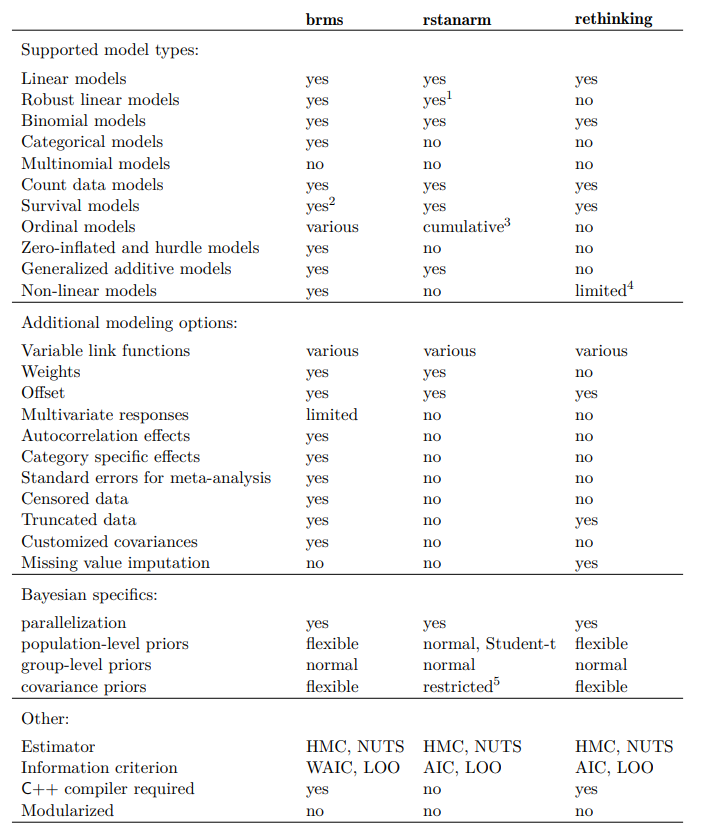

```{r setup, include=FALSE}
## ---- CRAN Packages ----
## Save package names as a vector of strings
pkgs <-
  c("foreign",
    "MASS",
    "coda",
    "rstan",
    "brms",
    "future",
    "bayesplot",
    "dplyr")

## Install uninstalled packages
lapply(pkgs[!(pkgs %in% installed.packages())],
       install.packages,
       repos = 'http://cran.us.r-project.org')

## Load all packages to library and adjust options
lapply(pkgs, library, character.only = TRUE)

## ---- Global learnr Objects ----
lab3_url <-
  "https://github.com/denis-cohen/statmodeling/raw/main/data/lab3.RData"
load(url(lab3_url))

## ---- Global chunk options ----
knitr::opts_chunk$set(echo = TRUE,
                      eval = FALSE)
```

## Exploring Bayesian inference via 'canned solutions'

### Motivation

As a segue into *model building* in Stan, we will use a 'canned solution'
for Bayesian inference via Stan's HMC sampler in this lab.

Some of the major 'canned solutions' that allow users to estimate and process
Stan models by calling pre-implemented R functions include:

- [**brms**](https://cran.r-project.org/package=brms): Bayesian Regression Models using 'Stan', covering a growing number of model types
- [**rstanarm**](https://cran.r-project.org/package=rstanarm): Bayesian Applied Regression Modeling via Stan, with an emphasis on hierarchical/multilevel models
- [**rethinking**](https://www.rdocumentation.org/packages/rethinking/versions/2.13): An R package that accompanies McElreath's course and book *Statistical Rethinking*
- [**edstan**](https://cran.r-project.org/package=edstan): Stan Models for Item Response Theory

### Comparison: Pre-implemented model types

```{r workflow, exercise = FALSE, echo = FALSE, eval = TRUE, out.width = '90%', fig.align="center"}

```

<div style="text-align: right"> 
  <sub><sup>
    Source: [Brückner, Paul-Christian (2022). brms: An R Package for Bayesian Multilevel Models
using Stan.](https://cloud.r-project.org/web/packages/brms/vignettes/brms_overview.pdf)
  </sub></sup>
</div>

### A minor note on multiple imputation in brms

Newer versions of `brms` now handle [missing values](https://cloud.r-project.org/web/packages/brms/vignettes/brms_missings.html):

- You can either generate multiply imputed data sets *before* model fitting, run multiple chains across each imputation, and then pool the posterior samples ($\rightarrow$ fast, but heavy on CPU and RAM)
- Alternatively, you can use Bayesian imputation *during* model fitting: `brms` will treat missing values as unknown quantities and jointly estimate your structural model of interest along with an imputation model ($\rightarrow$ slow)

## Application: A linear model in brms

### Choosing priors

`brms` uses default priors for certain "classes" of parameters. To check these defaults,
supply the model formula, data, and generative model (i.e., family and link function) to
`brms::get_prior()` and investigate the resulting object.

```{r brms-model-1, exercise = TRUE, eval = TRUE}
# Get default priors
default_priors <- brms::get_prior(
  sup_afd ~                              # outcome
    la_self *                            # immigration preferences
    se_self +                            # redistribution preferences
    fem +                                # gender
    east +                               # east/west residence
    age,                                 # age
  data = gles,                           # data
  family = gaussian(link = "identity")   # family and link
)
default_priors
```

*Note:* Missing entries in the `prior` column denote flat/uniform priors.

### Define custom priors

Suppose you don't like the default priors. You can create a `brmsprior` object
by specifying the desired distributional properties of parameters of
various classes:

```{r brms-model-2, exercise = TRUE, exercise.lines = 6, eval = TRUE}
custom_priors <- c(
  brms::prior(normal(0, 5), class = b),          # normal slopes
  brms::prior(normal(0, 5), class = Intercept),  # normal intercept
  brms::prior(cauchy(0, 5), class = sigma)       # half-cauchy SD
)
custom_priors
```

### Fitting the model

Lastly, you can fit the model using `brms::brm()`. Familiarize yourself with the function arguments and relate them to the concepts discussed in the previous two lectures.

*Notes:* 

- Model compilation and estimation may take a while.
- If, for whatever reason, `brms` throws an error when trying to call `rstan` on your machine, simply proceed to the next exercise. The required `brmsfit` object will be pre-loaded.

```{r brms-model-3, exercise = TRUE, exercise.lines = 15, exercise.timelimit = 120}
lm_brms <- brms::brm(
  sup_afd ~                              # outcome
    la_self *                            # immigration preferences
    se_self +                            # redistribution preferences
    fem +                                # gender
    east +                               # east/west residence
    age,                                 # age
  data = gles,                           # data
  family = gaussian(link = "identity"),  # family and link
  prior = custom_priors,                 # priors
  chains = 4L,                           # number of chains
  iter = 2000L,                          # number of iterations per chain
  warmup = 1000L,                        # number of warm-up samples per chain
  algorithm = "sampling",                # algorithm (HMC/NUTS)
  backend = "rstan",                     # backend (rstan)
  seed = 20221104L                       # seed
)
```

### Model summary and generic diagnostics

Print the model summary an familiarize yourself with the output. Check `Rhat` for any signs of non-convergence.

```{r brms-print, eval = TRUE}
lm_brms
```

### Visual diagnostics

Explore the following visualizations of common generic diagnostics:

```{r brms-visual, exercise = TRUE, exercise.lines = 3}
brms::mcmc_plot(lm_brms, type = "acf")   # Autocorrelation
brms::mcmc_plot(lm_brms, type = "trace") # Trace plots
```

### Canned quantities of interest: Expected values

`brms` also offers pre-implemented functions for plotting conditional
expectations.
Needless to say, these are not as flexible as manually
implemented solutions. But they can take you a long way in exploring
substantively meaningful quantities of interest at minimum effort.

For instance, for the continuous-by-continuous interaction
of `la_self` and `se_self`, `brms::conditional_effects()` will give you:

1. The conditional expectation of `sup_afd` as a function of `la_self`, at the mean of `se_self` and all other covariates
1. The conditional expectation of `sup_afd` as a function of `se_self`, at the mean of `la_self` and all other covariates
1. The conditional expectation of `sup_afd` as a function of `la_self` at three characteristic values of `se_self` (`mean(se_self) + c(-1, 0, 1) * sd(se_self)`), fixing all else at mean values

```{r brms-conditional-effects, exercise=TRUE, exercise.lines = 2}
brms::conditional_effects(lm_brms,
                          effects = c("la_self", "se_self", "la_self:se_self"))
```

### Canned estimation, manual processing

For more flexibility, you can always extract the posterior samples of the
coefficients and process them manually. We will illustrate this through
a simple example.

You can extract posterior draws of the model parameters from a
`brmsfit` object using the `brms::prepare_predictions()` function.
The function returns a nested list; the `$dpars` sublist contains,
among other, the posterior draws and the model data.
Check it out below:

```{r brms-prepare-predictions, exercise = TRUE}
str(brms::prepare_predictions(lm_brms)$dpars)
```

As you can see, the function output returns information pertaining to the 
systematic component of the model (incl. data and coefficients) in
`$dpars$mu$fe`, and everything pertaining to the auxiliary scale parameter,
$\sigma$, in `$dpars$mu$sigma`.

Extract the posterior samples of the model coefficients. Check the dimensions
of the object. What's in the rows, what's in the columns?

```{r brms-posterior-draws, exercise = TRUE}
# Get posterior samples of coefficients
...

# Check dimensions
...
```

```{r brms-posterior-draws-solution}
# Get posterior samples of coefficients
beta <- brms::prepare_predictions(lm_brms)$dpars$mu$fe$b

# Check dimensions
dim(beta)
```

Calculate the posterior distribution of the expected value of AfD
support for a hypothetical male, 60 year-old resident of West Germany
who holds strong anti-immigration and centrist redistribution preferences.
Report the posterior median and 95% credible interval.

```{r brms-lm-qoi, exercise = TRUE}
# Get posterior samples of coefficients
beta <- brms::prepare_predictions(lm_brms)$dpars$mu$fe$b

# Define covariate scenario
x_star <- c(
  1,     # Leading 1 to multiply the intercept
  10,    # Very strong anti-immigration (la_self = 10)
  5,     # Centrist on redistribution (se_self = 5)
  0,     # male (fem = 0)
  0,     # West-German (east = 0)
  60,    # 60 years of age (age = 60)
  10 * 5 # Multiplicative term (la_self * se_self)
)

# Posterior distribution of the expected value
exp_val <- ...

# Quantile summary
...
```

```{r brms-lm-qoi-solution}
# Get posterior samples of coefficients
beta <- brms::prepare_predictions(lm_brms)$dpars$mu$fe$b

# Define covariate scenario
x_star <- c(
  1,     # Leading 1 to multiply the intercept
  10,    # Very strong anti-immigration (la_self = 10)
  5,     # Centrist on redistribution (se_self = 5)
  0,     # male (fem = 0)
  0,     # West-German (east = 0)
  60,    # 60 years of age (age = 60)
  10 * 5 # Multiplicative term (la_self * se_self)
)

# Posterior distribution of the expected value
exp_val <- beta %*% x_star

# Quantile summary
quantile(exp_val, c(.5, .025, .975))
```

### Model code

`brms` compiles a Stan model program in C++ in the `rstan` backend according to
the `brm()` function arguments supplied by the user.

Explore the underlying Stan model code and try to make sense of it.

```{r brms-code, echo = T}
brms::stancode(lm_brms)
```

We will, of course, discuss Stan programs in-depth in the next session.

## Bonus: Posterior predictive checks

### Posterior predictive checks

Posterior predictive checks involve simulating the data-generating process to
obtain replicated data given the estimated model. They can help us determine
how well our model fits the data.

This usually involves two questions:

1. Does the *family* yield an adequate generative model?
    - Does a Gaussian (normal) data-generating processes produce realistic replications of the observed values of `sup_afd` (support for the AfD on the -5 to +5 scale)?
    - Does the simulated distribution of the replications match the observed distribution of the outcome in the *sample*?
1. Does the *systematic component* accurately predict outcomes?
    - Do our predictors -- i.e., an interaction of redistribution and immigration preferences -- accurately predict which individuals are more likely to support the AfD?
    - How large is the *observation-level discrepancy* between simulated replications and observed data?

### Distributional congruence

To check whether the generative model produces distributions of replicated outcomes that match the distribution of the observed outcome, we can compare the density of the observed outcome with those of, say, `ndraws = 100` simulations. Each simulation is based on one post-warm-up sample from the posterior distribution.

```{r brms-lm-pp-1, echo = T, fig.align='center', fig.width = 8, fig.height=6}
brms::pp_check(lm_brms, ndraws = 100, type = "dens_overlay")
```

So, what do you think?

### Observation-level prediction error

To check the predictive accuracy of the model, we can investigate the distribution of observation-level prediction errors. A model with perfect fit would produce an error of $0$ for all $N$ observations.

Below, you see the distribution of errors for our linear model. What do you think?

```{r brms-lm-pp-2, echo = T, fig.align='center', fig.width = 9, fig.height=6}
brms::pp_check(lm_brms, ndraws = 1, type = "error_hist")
```

### Refit the model as a zero-one-inflated beta (ZOIB) regression

Zero-one-inflated beta (ZOIB) regression models bounded continuous outcomes on the
unit (i.e., $[0,1]$) interval.
The ZOIB model is a GLM with a multi-family likelihood, meaning
that its likelihood is composed of a mixture of several constitutive likelihoods.
Specifically, it supplements a beta pdf for values $y \in ]0, 1[$ with
additional pmfs for the boundary values $y \in \{0,1\}$.

<details><summary> Some background on the ZOIB model</summary>
To fully understand the model, we must quickly return to the beta distribution,
which we previously characterized in terms of two strictly positive
*shape parameters*, $a>0$ and $b>0$.

These shape parameters can also be expressed in terms of a location
parameter $\mu$ and a scale parameter $\phi$, where $a = \mu \cdot \phi$
and $b = (1 - \mu) \cdot \phi$, with $\mu \in [0, 1]$ and $\phi > 0$.

Next to this reparameterized beta pdf, the model accommodates two Bernoulli
pmfs: The first models 0/1 observations as a function of a probability parameter
$\text{zoi}$ (short for zero-one-inflation), the second models 1's (as opposed
to 0's), conditional on observing a 0/1 observation, as a function of a
probability parameter $\text{coi}$ (short for conditional-one-inflation).

Taken together, the zero-one-inflated beta model is given by:

$$
p(y_i| \mu_i, \phi_i, \text{zoi}_i, \text{coi}_i) =
\begin{cases}
    \text{Bernoulli}(1 | \text{zoi}_i) \times \text{Bernoulli}(0|  \text{coi}_i)& \text{if } y = 0 \\
    \text{Bernoulli}(1 | \text{zoi}_i) \times \text{Bernoulli}(1|  \text{coi}_i)& \text{if } y = 1 \\
    \text{Bernoulli}(0 | \text{zoi}_i) \times \text{Beta}(y| \mu_i \cdot \phi_i, (1 - \mu_i) \cdot \phi_i)& \text{if } y_i \in ]0,1[
\end{cases}
$$

where

$$
\begin{align}
  \text{zoi}_i = & \text{invlogit}(\mathbf{x}_i^\prime{\beta}_{\text{zoi}}) \\
  \text{coi}_i = & \text{invlogit}(\mathbf{x}_i^\prime{\beta}_{\text{coi}}) \\
  \mu_i = & \text{invlogit}(\mathbf{x}_i^\prime{\beta}_{\mu}) \\
  \phi_i = & \log(\mathbf{x}_i^\prime{\beta}_{\phi})
\end{align}
$$

*Note:* Technically, we could use different predictors in each of these four equations. But to keep it "simple", we will use the same $\mathbf{x}_i$ across all four.
</details>


### Inference

To model a bounded continuous outcome on the unit interval, we must first
rescale it. Therefore, we will transform the scale of AfD support to range
from 0 to 1 (with midpoint 0.5) instead of -5 to +5 (with midpoint 0).
No worries, we can always scale it back later on.

```{r brms-zoib rescale, echo = T, eval = FALSE}
gles <- gles %>%
  dplyr::mutate(
    sup_afd_unit = scales::rescale(sup_afd, to = c(0, 1))
  )
```

We can fit in `brms` (note that the corresponding `brmsfit` object will be pre-loaded):

```{r brms-zoib, echo = T, eval = FALSE}
zoib_brms <- brms::brm(
  formula = bf(
    sup_afd_unit ~ la_self * se_self, # Model for the mean of the beta
    phi ~ la_self * se_self,          # Model for the precision of the beta
    zoi ~ la_self * se_self,          # Model for zero/one inflation
    coi ~ la_self * se_self           # Conditional model for zero vs one infl.
  ),                             
  data = gles,                           # data
  family = zero_one_inflated_beta(       # family and links
    link = "logit",
    link_phi = "log",
    link_zoi = "logit",
    link_coi = "logit"
  ),
  prior = c(                             # priors
    brms::prior(normal(0, 5), class = b),
    brms::prior(normal(0, 5), class = Intercept)
  ),
  chains = 4L,                           # number of chains
  iter = 2000L,                          # number of iterations per chain
  warmup = 1000L,                        # number of warm-up samples per chain
  algorithm = "sampling",                # algorithm (HMC/NUTS)
  backend = "rstan",                     # backend (rstan)
  future = TRUE,                         # use future for parallelization
  seed = 20221104L                       # seed
)
```

### Posterior predictive checks

We first observe the distributional congruence of the ZOIB-generated outcome
simulations.

```{r brms-zoib-pp-1, echo = T, fig.align='center', fig.width = 8, fig.height=6}
brms::pp_check(zoib_brms, ndraws = 100, type = "dens_overlay")
```

We then turn to checking observation-level prediction errors.

```{r brms-zoib-pp-2, echo = T, fig.align='center', fig.width = 8, fig.height=6}
brms::pp_check(zoib_brms, ndraws = 1, type = "error_hist")
```

What do you conclude? Does the ZOIB-family accurately model the observed
sample-level distribution of the outcome? Are you happy with the predictive
accuracy of our current systematic component?

## Bonus: QOI or multi-family models

### Quantities of interest

The (somewhat) annoying part with multi-family models is that the
computation of substantively meaningful quantities of interest becomes
a lot more intricate.

For ZOIB models, the expected values depends on coefficients
from three different equations (for mathematical details, see [Liu and Kong 2015)](https://journal.r-project.org/archive/2015/RJ-2015-019/RJ-2015-019.pdf):

$$
\begin{align}
  \mathbb{E}[y_i | \mathbf{x}_i] & = (1 - p_i) \left(q_i + (1 - q_i) \mu_i \right)
\end{align}
$$

where

$$
\begin{align}
  p_i & = \text{invlogit}(\mathbf{x}_i^\prime{\beta}_{\text{zoi}}) \times (1 - \text{invlogit}(\mathbf{x}_i^\prime{\beta}_{\text{coi}})) \\
  q_i & = \text{invlogit}(\mathbf{x}_i^\prime{\beta}_{\text{coi}}) \times \text{invlogit}(\mathbf{x}_i^\prime{\beta}_{\text{zoi}}) \times (1  - p_i)^{-1} \\
  \mu_i & = \text{invlogit}(\mathbf{x}_i^\prime{\beta}_{\mu})
\end{align}
$$

Here, it really pays off to write a function. Note that the `rescale_to` argument
allows us to scale the outcome back to the -5/+5 scale.


```{r brms-zoib-qoi, echo = T}
exp_val_zoib <- function(x,
                         b,
                         b_zoi,
                         b_coi,
                         rescale_to = NULL,
                         posterior_quantiles = c(.5, .025, .975)) {
  
  # Get probabilities
  mu <- plogis(b %*% x)
  coi <- plogis(b_coi %*% x)
  zoi <- plogis(b_zoi %*% x)
  p <- zoi * (1 - coi)
  q <- zoi * coi / (1 - p)
  
  
  
  # Get expected value
  exp_val <- as.vector((1 - p) * (q + (1 - q) * mu))
  
  # Rescale
  if (!is.null(rescale_to)) {
    exp_val <- exp_val * abs(diff(rescale_to)) + rescale_to[1]
  }
  
  # Get posterior quantiles
  exp_val_quantiles <- quantile(exp_val, posterior_quantiles)
  
  # Value
  return(exp_val_quantiles)
}
```

We can then apply this function to get the expected value for
a hypothetical individual with strong anti-immigration 
and centrist redistribution preferences:

```{r brms-zoib-manual, echo = T, fig.align='center', fig.width = 9, fig.height=6}
# Get posterior samples of coefficients
b <- brms::prepare_predictions(zoib_brms)$dpars$mu$fe$b
b_phi <- brms::prepare_predictions(zoib_brms)$dpars$phi$fe$b
b_zoi <- brms::prepare_predictions(zoib_brms)$dpars$zoi$fe$b
b_coi <- brms::prepare_predictions(zoib_brms)$dpars$coi$fe$b

# Define covariate scenario
x_star <- c(
  1,     # Leading 1 to multiply the intercept
  10,    # Very strong anti-immigration (la_self = 10)
  5,     # Centrist on redistribution (se_self = 5)
  10 * 5 # Multiplicative term (la_self * se_self)
)

# Quantile summary of the posterior distribution of the expected value
exp_val_zoib(
  x = x_star,
  b = b,
  b_zoi = b_zoi,
  b_coi = b_coi,
  rescale_to = c(-5, 5),
  posterior_quantiles = c(.5, .025, .975)
)
```
