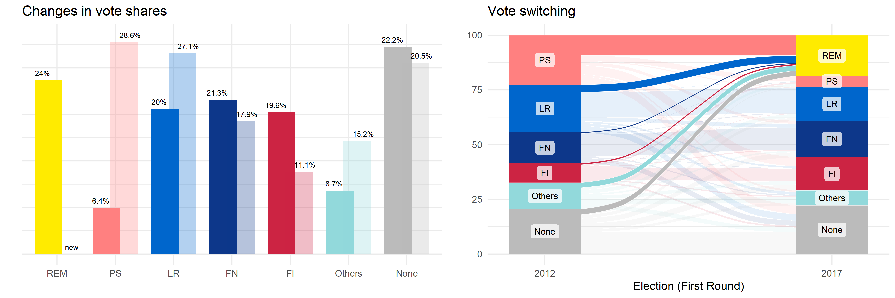
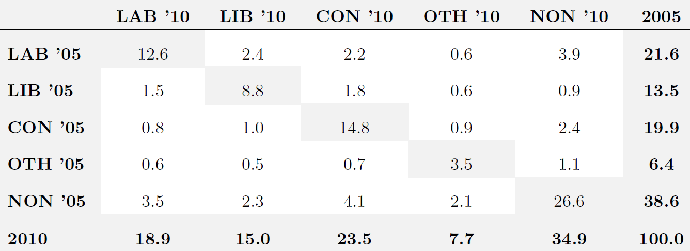

```{r setup, include=FALSE}
knitr::opts_chunk$set(echo = FALSE,
                      eval = TRUE,
                      error = TRUE)

## ---- CRAN Packages ----
## Save package names as a vector of strings
pkgs <-  c("rstan", "rstantools", "coda", "dplyr")

## Install uninstalled packages
lapply(pkgs[!(pkgs %in% installed.packages())], 
       install.packages,
       repos='http://cran.us.r-project.org')

## Load all packages to library and adjust options
lapply(pkgs, library, character.only = TRUE)

## ---- GitHub Packages ----


## ---- Global learnr Objects ----

## ---- export function ----
export <- function(env = environment()) {
  invisible({
    global_obj <- eval(global_objects, envir = globalenv())
    local_obj <- ls(envir = env)
    new_obj <- local_obj[!(local_obj %in% global_obj)]
    sapply(new_obj, function(x) {
      assign(x, get(eval(x, envir = env), envir = env), envir = globalenv())
    })
  })
  if (!is.null(new_obj)){
    print("Exported objects:")
    print(new_obj)
  }
}
global_objects <- c(ls(), "global_objects")

## ---- rstan Options ----
rstan_options(auto_write = TRUE)             # avoid recompilation of models
options(mc.cores = parallel::detectCores())  # parallelize across all CPUs
```


## [Model blocks](https://mc-stan.org/docs/2_26/reference-manual/blocks-chapter.html)

### Main model blocks for Bayesian inference

As we established in the last session, a Stan program for *Bayesian inference* must include the following model blocks:

1. **Data**: Declare all known quantities, including data types, dimensions, and constraints
1. **Parameters**: Declare unknown 'base' quantities, including storage types, dimensions, and constraints
1. **Model**: Declare and specify local variables (optional) and specify sampling statements for priors and likelihood


### Other model blocks

In this session, we want to pay closer attention to the four other model blocks:

1. **Functions**: Declare user written functions
1. **Transformed Data**: Declare and define/transform  data inputs 
1. **Transformed Parameters**: Declare and transform parameters 
1. **Generated Quantities**: Declare and generate derivative quantities

### "Trivial" tasks

As Stan is a full-blown statistical programming language, we can also accommodate numerous other tasks in the model.

As `rstan` users, however, the question with many of these tasks is whether we cannot accommodate them more efficiently in R before or after estimation.


### Some tasks that *can* be implemented as part of a Stan program

- Data standardization:
    - We could first define a function that standardizes our variables in the `functions` block and then apply it to the data in the `transformed data` block.
    - But we can equally standardize the data in R and pass the standardized variables to Stan.
- Transformed parameters:
    - Last session, we sampled the linear predictor `eta` as a global variable in the `transformed parameters` block, which we (could have) sampled.
    - We could have equally defined `eta` as a temporary local variable in the `model block`, where it would have been discarded after each iteration...
    - ...and recovered it in R per $\mathbf{X\beta}$ if necessary.
- Quantities of interest:
    - We can use the `generated quantities` block to calculate quantities of interest (expected values, average marginal effects, etc.) or to implement posterior predictive checks.
    - But we can do this just as well in R using the posterior draws and the data.
    
### My recommendation

There is nothing wrong per se with accommodating such "trivial tasks" in Stan. But several efficiency concerns may speak against it:

- If you are more proficient in R than in Stan, implementing tasks in Stan that you could easily perform in R is time not wisely invested.
- If you need to adjust transformations on a rolling basis (e.g., changing covariate scenarios for your quantities of interest), it is wise to separate estimation from "post-estimation" work.
- *Most importantly:* Computational resources can be *expensive*!
    - Once your Stan models get too big to run on local machines, efficiency is money (literally!).
    - Minimize run times by restricting your Stan model to essential tasks (i.e., estimation).
    - Limit your RAM usage to what's necessary; do not sample (transformed) parameters you do not need!


### Other model blocks: Essential tasks

There are, however, some essential tasks that should or must be accommodated in Stan:

- Functions needed for estimation (e.g., custom log-density functions)
- Transformed parameters that are of primary interest
    - In many instances, it is computationally *more* efficient to specify priors for "raw parameters" and transform these before they enter the likelihood.
    - In these cases, your primary concern should be sampling and diagnosing the transformed parameters.


### Weighted likelihood

- Weights ensure that observations do not contribute to the log-likelihood equally, but proportionally to their idiosyncratic weights.
- Let's incorporate this feature into our Stan program for the linear model. 
- The hack requires two things:
    - the definition of a new function
    - Two minor, single-line modifications: One in the `data`, one in the `model` block 
    
### The unweighted normal log-likelihood

We first need to understand the built-in function for the unweighted log-likelihood, `normal_lpdf`. 

`normal_lpdf` defines the log of the [normal probability density function](https://en.wikipedia.org/wiki/Normal_distribution) (pdf) and sums across the resulting values of all observations, which returns a scalar:

$$ \mathtt{normal\_lpdf(y | eta, sigma)} = \sum_{i=1}^{N}\frac{1}{2} \log (2 \pi \sigma^2) \Big( \frac{y_i-\eta_i}{\sigma}\Big)$$

### The weighted normal log-likelihood

Why is this problematic? 

- To include weights, we need to weight every single entry in the log normal pdf *prior to* aggregation. 
- So, we need a length-$N$ vector of $\mathtt{normal\_lpdf}$ values that we can then multiply with a length-$N$ vector of weights before we sum across all observations. 
- We therefore define a new function that returns the point-wise log normal pdf:

```{stan ext1a, output.var="ext1a", eval = FALSE, echo = TRUE}
functions {
  vector pw_norm(vector y, vector eta, real sigma) {
    return -0.5 * (log(2 * pi() * square(sigma)) + 
                     square((y - eta) / sigma));
  }
}
```


### Code modifications

The remaining modifications are straightforward:

- We declare a vector of length $N$ with idiosyncratic weights in the data block.
- In the model block,  we take the dot product of the `weights` vector and the vector of log-likelihood entries generated by `pw_norm`:

```{stan ext1b, output.var="ext1b", eval = FALSE, echo = TRUE}
data {
  ...
  vector<lower=0>[N] weights;  // weights
}

...

model {
  ...
  
  // weighted log-likelihood
  target += dot_product(weights, pw_norm(y, eta, sigma));
}

```

The dot product returns the sum of the pairwise products of entries of both vectors, which gives us our weighted log-likelihood:

$$\mathtt{dot\_product(weights, pw\_norm(y, eta, sigma))} = \\ \sum_{i=1}^{N}\mathtt{weights}_i \times \frac{1}{2} \log (2 \pi \sigma^2) \Big( \frac{y_i-\eta_i}{\sigma}\Big)$$

### Standardized Data

- For this example from the [Stan User's Guide](https://mc-stan.org/docs/2_19/stan-users-guide/standardizing-predictors-and-outputs.html), we use the transformed data block to standardize our outcome variable and predictors. 
- Standardization can help us *boost the efficiency* of our model by allowing the model to converge toward the posterior distribution faster.

### Transformed data 

- Our initial data inputs remain the same as in the original example: We declare $N$, $K$, $\mathbf{X}$ and $\mathbf{y}$ in the data block. 
- We then use the transformed data block to standardize both $\mathbf{y}$ and every column of $\mathbf{X}$ (except the leading column of 1's that multiplies the intercept).

```{stan ext2-1, output.var="ext2-1", eval = FALSE, echo = TRUE}
transformed data {
  vector[K-1] sd_x;       // std. dev. of predictors (excl. intercept)
  vector[K-1] mean_x;     // mean of predictors (excl. intercept)
  vector[N] y_std;        // std. outcome 
  matrix[N,K] x_std = x;  // std. predictors
  
  y_std = (y - mean(y)) / sd(y);
  for (k in 2:K) {
    mean_x[k-1] = mean(x[,k]);
    sd_x[k-1] = sd(x[,k]);
    x_std[,k] = (x[,k] - mean_x[k-1]) / sd_x[k-1]; 
  }
}
```

### Consequences and code modifications

- As a result of standardization, the posterior distributions of our estimated parameters change. 
- But we can use the generated quantities block to transform these parameters back to their original scale.
- For now, we only need to declare the parameters for the standardized variables.


```{stan ext2-2, output.var="ext2-2", eval = FALSE, echo = TRUE}
parameters {
  vector[K] beta_std;      // coef vector
  real<lower=0> sigma_std; // scale parameter
}

model {
  // local variables
  vector[N] eta_std;          // declare lin. pred.
  eta_std = x_std * beta_std; // assign lin. pred.

  // priors
  target += normal_lpdf(beta_std | 0, 10);  // priors for beta_std
  target += cauchy_lpdf(sigma_std | 0, 5);  // prior for sigma_std
  
  // log-likelihood
  target += normal_lpdf(y_std | eta_std, sigma_std); // likelihood
}
```

### Retrieving the original parameters

Using our draws for the alternative parameters `beta_std` and `sigma_std`, we can then use a little algebra to retrieve the original parameters:

- $\beta_1 = \text{sd}(y) \Big(\beta_1^{\text{std}} - \sum_{k=2}^{K} \beta_k^{\text{std}} x_k^{\text{std}}\Big) + \bar{\mathbf{y}}$
- $\beta_k = \beta_k^{\text{std}} \frac{\text{sd}(y)}{\text{sd}(x_k)} \text{ for } k = 2,...,K$
- $\sigma = \text{sd}(y) \sigma^{\text{std}}$

These calculations are implemented in the generated quantities block below:

```{stan ext2-3, output.var="ext2-3", eval = FALSE, echo = TRUE}
generated quantities {
  vector[K] beta;          // coef vector
  real<lower=0> sigma;     // scale parameter
  
  beta[1] = sd(y) * (beta_std[1] - 
    dot_product(beta_std[2:K], mean_x ./ sd_x)) + mean(y);
  beta[2:K] = beta_std[2:K] ./ sd_x * sd(y);
  sigma = sd(y) * sigma_std;
}
```

### Sampling

We can then simply sample the original parameters produced in the `generated quantities` block:

```{r inf-sampl, eval = F, echo = TRUE}
lm_std <- rstan::sampling(
  lm_std,                     # compiled model
  data = standat_inf,         # data input
  algorithm = "NUTS",         # algorithm
  control = list(             # control arguments
    adapt_delta = .85),
  save_warmup = FALSE,        # discard warmup sims
  sample_file = NULL,         # no sample file
  diagnostic_file = NULL,     # no diagnostic file
  pars = c("beta", "sigma"),  # select parameters
  iter = 2000L,               # iter per chain
  warmup = 1000L,             # warmup period
  thin = 2L,                  # thinning factor
  chains = 2L,                # num. chains
  cores = 2L,                 # num. cores
  seed = 20210329)            # seed
```

### Efficiency concerns

Note that this procedure is essentially cost-free and likely to speed up computation:

- `transformed data` is only evaluated once; essentially zero extra time
- sampling in `model` will be faster
- while evaluated after each iteration, the transformations in `generated quantities` simple and have no feedback into the `model` block
- we do not need to sample additional parameters


## The hierarchical logit model

### Starting point: Building a simple logit model

Below, you find the code for the linear model from the previous lecture.

*Note:* `eta` is now a local variable in the `model` block, not a variable in the `transformed parameters` block.

Let's use it a basis to build our logit model.

  - Which quantities can stay?
  - Which quantities must go?
  - What do we need to add?
  - What do we need to change?

```{stan logit1, echo = TRUE, output.var = "none", eval = FALSE}
data {
  int<lower=1> N; // num. observations
  int<lower=1> K; // num. predictors
  matrix[N, K] x; // design matrix
  vector[N] y;    // outcome vector
}

parameters {
  vector[K] beta;      // coef vector
  real<lower=0> sigma; // scale parameter
}

model {
  // local variables
  vector[N] eta;  // declare lin. pred.
  eta = x * beta; // assign lin. pred.

  // priors
  target += normal_lpdf(beta | 0, 10);  // priors for beta
  target += cauchy_lpdf(sigma | 0, 5);  // prior for sigma
  
  // log-likelihood
  target += normal_lpdf(y | eta, sigma); // likelihood
}
```

```{stan logit1-solution, output.var = "none", eval = FALSE}
data {
  int<lower=1> N;                  // num. observations
  int<lower=1> K;                  // num. predictors
  matrix[N, K] x;                  // model matrix
  array[N] int<lower=0,upper=1> y; // outcome
}

parameters {
  vector[K] beta;      // coef vector
}

model {
  // local variables
  vector[N] eta;  // declare lin. pred.
  eta = x * beta; // assign lin. pred.

  // priors
  target += normal_lpdf(beta | 0, 10);  // priors for beta

  // log-likelihood
  target += bernoulli_logit_lpmf(y | eta); // likelihood, incl. inverse link
}
```

### Extension 1: Varying intercepts

- Extending our model to become a hierarchical varying-intercept model is easy.
- All we need to do is extend the linear predictor with a group-specific zero-mean random effect:

$$y_{ij} \sim \text{Bernoulli}(\text{logit}^{-1}(\mathbf{x}_i^{\prime} \beta + \nu_{j_{[i]}})) \\
\nu_j \sim \text{Normal}(0, \sigma_{\nu})$$

- We accomplish this by adding a standard normal parameter in the `parameters` block, and scaling it in the `transformed parameters` block. 
- Note that the choice of the normal distribution is arbitrary: We could change the distribution of these "random deviation" from the intercept in any (plausible) way we like!
- Of course, we also need an integer array that indicates each unit's group membership.

### Varying-intercepts logit model: Code

```{stan logit2, output.var = "none", echo = TRUE, eval = F}
data {
  int<lower=1> N;                    // num. observations
  int<lower=1> K;                    // num. predictors
  int<lower=1> J;                    // num. groups
  array[N] int<lower=1, upper=J> jj; // group index
  matrix[N, K] x;                    // model matrix
  array[N] int<lower=0, upper=1> y;  // outcome
}

parameters {
  vector[K] beta;          // coef vector
  vector[J] nu_raw;        // unscaled random effect
  real<lower=0> sigma_nu;  // scale of random effect
}

transformed parameters {
  vector[J] nu;            // scaled random effect
  nu = nu_raw * sigma_nu;
}

model {
  // local variables
  vector[N] eta;
  
  eta = x * beta + nu[jj];                  // linear predictor

  // priors
  target += normal_lpdf(beta | 0, 10);      // priors for beta
  target += normal_lpdf(nu_raw | 0, 1);     // priors for nu_raw
  target += cauchy_lpdf(sigma_nu | 0, 5);   // prior for scale of nu

  // log-likelihood
  target += bernoulli_logit_lpmf(y | eta); // likelihood, incl. inverse link
}
```


### Extension 2: Varying intercepts, varying slopes

- Extending our model to become a hierarchical varying-intercept, vary-slopes model where intercepts and slopes are mutually correlated is a bit more intricate.
- Suppose we would like to have a varying slope for one variable, $x$, but none for all other covariates $\mathbf{z}$. 
- Defining $\mathbf{x}^{\prime} = \begin{bmatrix} 1 & x_i \end{bmatrix}$, this yields the following model:

$$y_{ij} \sim \text{Bernoulli}(\text{logit}^{-1}(\mathbf{x}_i^{\prime} \beta_{j_{[i]}} + \mathbf{z} _i^{\prime} \gamma)) \\
\beta_{1j} = \beta_1 + \nu_{1j} \\
\beta_{2j} = \beta_2 + \nu_{2j} \\
\begin{bmatrix} \nu_{1j} \\ \nu_{2j} \end{bmatrix} \sim \text{MVN}\left( \begin{bmatrix} 0 \\ 0 \end{bmatrix}, \Sigma_{\nu} \right)$$

- This is exactly the form in which we implement the model below.
- We use a little efficiency trick for the variance covariance matrix of $\nu$:
    - We decompose the variance covariance matrix into:
        - A Cholesky correlation factor $\Omega$ with a Cholesky LKJ correlation prior
        - A scale vector $\tau$
    - We then use both components in the `transformed parameters` block to retrieve the variance-covariance matrix $\Sigma_{nu}$.

### Varying-intercepts, varying slopes logit model: Code

```{stan logit3, output.var = "none", echo = TRUE, eval = F}
data {
  int<lower=1> N;                      // num. observations
  int<lower=1> K;                      // num. predictors w. varying coefs
  int<lower=1> L;                      // num. predictors w. fixed coefs
  int<lower=1> J;                      // num. groups
  array[N] int<lower=1, upper=J> jj;   // group index
  matrix[N, K] x;                      // matrix varying predictors, incl. intercept
  matrix[N, L] z;                      // matrix fixed predictors, excl. intercept
  array[N] int<lower=0, upper=1> y;    // outcome
}

transformed data {
  row_vector[K] zeroes;               // a length-K row vector of 0's
  zeroes = rep_row_vector(0.0, K);
}

parameters {
  // Fixed portions
  vector[K] beta;      // fixed coef predictors w. varying coefs
  vector[L] gamma;     // fixed coef predictors w. fixed coefs
  
  // Random portions
  array[J] vector[K] nu;            // group-specific deviations
  cholesky_factor_corr[K] L_Omega;  // prior correlation of deviations
  vector<lower=0>[K] tau;           // prior scale of deviations
}

transformed parameters {
  // Variance-covariance matrix of random deviatons
  matrix[K,K] Sigma;
  Sigma = diag_pre_multiply(tau, L_Omega) * diag_pre_multiply(tau, L_Omega)';
}

model {
  // local variables
  vector[N] eta;
  
  // linear predictor
  eta = x * beta + z * gamma;               // lin. pred. without random effect
  for (i in 1:N) {
    eta[i] = eta[i] + x[i, ] * nu[jj[i]];   // add group-specific random effects
  }
  
  // priors
  target += normal_lpdf(beta | 0, 10);               // priors for beta
  target += normal_lpdf(gamma | 0, 10);              // priors for gamma
  target += cauchy_lpdf(tau | 0, 5);                 // prior for scales of nu
  target += lkj_corr_cholesky_lpdf(L_Omega | 2.0);   // Cholesky LJK corr. prior
  target += multi_normal_lpdf(nu | zeroes, Sigma);   // nu


  // log-likelihood
  target += bernoulli_logit_lpmf(y | eta); // likelihood, incl. inverse link
}
```

### Transferability to other GLM

The specification of univariate or multivariate random effects is fairly general. It does not depend on a specific type of GLM. 

You could equally use the respective code chunks in a linear model or a tobit model, for instance. This is an example of modular model building.


## Developing your own Stan models

### Motivation

- The above example shows how one can continuously expand the complexity of a Stan model.
- Yet, this is still a standard hierarchical model that you could equally estimate using a 'canned solution'.
- At some point, however, you will likely want to push past the boundaries of such canned solutions.
- Below are some motivating examples.

### Relaxing model assumptions

- You estimate a hierarchical GLM with random intercepts and few groups.
- Reviewer 2 has read up on some recent publications (e.g., [Stegmueller 2013](https://onlinelibrary.wiley.com/doi/full/10.1111/ajps.12001); [Elff et al. 2020](https://www.elff.eu/article/multilevel-improving/)) and criticizes your use of normally distributed random effects.
- Why not use Stan to relax this distributional assumption?
- You may, e.g., reestimate your model with different distributions for your random effects, and conduct simulation studies to test their relative performance towards one another.

### Heterogeneous treatment effects

- You conduct an RCT with a binary treatment on political attitudes.
- You use a standard difference-in-means estimator, which yields a null effect.
- This is in line with your expectations, as you expect that the treatment will "shift" some individuals to the left, others to the right.
- You cannot accurately characterize left-shifters an right-shifters in terms of covariates and, therefore, not present meaningful subgroup-specific difference-in-means estimates.
- Why not focus on the variance, then?
- Use Stan to implement a "difference-in-variances" estimator. Use the posterior distribution for inference on the question if your treatment polarizes political attitudes among treated individuals relative to control units.

### Re-running (and extending) models written in defunct or proprietary programming languages

- In *When Moderate Voters Prefer Extreme Parties*, [Kedar (2005)](https://www.cambridge.org/core/journals/american-political-science-review/article/when-moderate-voters-prefer-extreme-parties-policy-balancingin-parliamentary-elections/A6729F56D47DDD3993DD3CA02840B6B0) proposes a formal model for representational (sincere) and compensational (strategic) voting.
- The model involves a mixing parameter, $\beta$: $$u_{ij} = \theta [-\beta \times \text{representational}_{ij} - (1 - \beta) \times \text{compensational}_{ij}] + \mathbf{z}_{i}^{\prime}\delta_j $$
- The empirical analyses implement this idea in a conditional logit model with a constrained mixing parameter, $\beta \in [0,1]$, and coded up in [GAUSS](https://en.wikipedia.org/wiki/GAUSS_(software)).
- Why not implement this model in Stan?
- Why not transfer the idea of a mixing parameter to a different type of model?
- Why not extend the idea of a mixing parameter from two to three (or more) components, and allow it to vary? One example: A trivariate heterogeneous mixing parameter that tests how consistently policy distances on (1) socio-economic issues, (2) immigration, and (3) climate change affect vote choices for voters of different generations?

### An example from my own research: Modeling comparative vote switching

```{r france, exercise = FALSE, echo = FALSE, out.width = '90%', fig.align="center"}

```

### Voter transition matrices

```{r transition , exercise = FALSE, echo = FALSE, out.width = '90%', fig.align="center"}

```

#### Basic quantities of interest

1. *Party-specific retention rates*, $p_{i,i}$
2. *Dyadic gross gains/losses*, $p_{i,j}$
3. *Dyadic trade volumes*, $V_{i,j} = p_{j,i} + p_{i,j}$
4. *Dyadic trade balances*, $V_{i,j} = p_{j,i} - p_{i,j}$
  
#### Derived quantities of interest: Aggregate and normalize as needed

Let our quantity of interest be *government parties'* trade balances with *opposition parties*, *relative to their own support base at t - 1*:

$$\text{QOI} = \frac{100 \times \sum_{j = 2}^{4} p_{j, 1} -  p_{1, j}}{\sum_{k = 1}^{5} p_{1, k}} = \frac{100 \times (2.6 - 5.2)}{21.6} \approx 12.0$$

### Mixed Aggregate MNL Model with Varying Choice Sets (MAVCL)

#### Description

MAVCL models latent election-level *cell proportions*, $\Pr(y_{j} = c)$, derived as average micro-level *choice probabilities*, based on cell counts, $w_{jc}$:

- A categorical likelihood at the voter level models individual *choice probabilities* (as in MNL).
- As the model only involves election-level covariates, we can re-express this model at the election-level with $w_{jc}$'s serve as election-and-cell-specific frequency weights. This yields a multinomial quasi-likelihood at the election-level.
- Here, election-cell-specific random effects capture variation of interest: Latent election-specific *cell proportions*.
- Party system heterogeneity yields election-specific choice sets $S_j = \{1,...,C\}$
  + some outcomes categories $c$ will be deterministically empty
  + accommodated in a modified softmax link function (see Yamamoto 2014)


#### Formal notation

- Linear component: $\eta_{jc} = \alpha_c + \mathbf{x}_j^{\prime} \beta_c + \nu_{jc} \text{  for each  } c \in S_{j}$
- Link function: $\Pr(y_{j} = c | \mathbf{x}_j) = \frac{\exp(\eta_{jc})}{\sum_{c \in S_{j}} \exp(\eta_{jc})}$
- Likelihood: $\log L = \sum_{j=1}^{J} \sum_{c \in S_{j}} w_{jc} \log \Pr(y_{j} = c | \mathbf{x}_j)$

## Take-aways for aspiring model developers

### Determine if a 'canned solution' already exists.

1. It exists and accomplishes exactly what you want to do? $\rightarrow$ Use it!
2. It exists but falls short of accomplishing *exactly* what you want to do? $\rightarrow$ Build up on it!
3. It doesn't exist? $\rightarrow$ Build your own model! Note that while it may seem like you are starting from scratch, but most likely, many parts of your model will resemble existing (Stan) models.

### Moving beyond 'canned solutions'

1. Choose the correct likelihood for your model. Stan will almost certainly feature the required log probability function. If it doesn't, translate the mathematical log-likelihood function to a custom `lpmf`/`lpdf` function.
2. Think about the "right-hand side" of your model formula (i.e., systematic component and inverse link). Start simple, increase flexibility step-wise.
3. Use the documentation and the vast online resources. Seek help when necessary.
4. Once your model runs: Validate it.
5. Once validated, move on to inference. Carefully diagnose your model!

### Computational problems

Suppose one or several of the following apply:

- Your algorithm-specific diagnostics throw warnings (that don't go away easily)
- Your convergence diagnostics indicate signs of non-convergence (and increasing the warm-up period doesn't help)
- Everything converges, but you get non-sensical estimates and predictions
- You are confident that your model will eventually converge to a well-behaved target distribution but it takes *forever* and even lengthy runs won't get you there (yet).

Then what? 

### Addressing computational problems

Gelman et al. (2020) have some answers:

### Check for model misspecification

- Is the probability model correctly specified?
- Are constraints set adequately?
- Do your priors allow for posterior density in regions where you'd expect it?
- Are your parameters statistically identified?

### When a complex model fails: Reduce complexity

- Suppose you fit a mixture model with two equations, a constrained probabilistic mixing parameter, and various random effects in each equation
- Fit each equation separately without the random effects
- Fit the mixture model without the random effects
- Fit each equation with random effects

### Be time-efficient

- Test the model on small sets of well-behaved simulated data
- Test the model using short runs

### [Efficiency tuning](https://mc-stan.org/docs/2_26/stan-users-guide/optimization-chapter.html)

- Vectorize: Use matrix multiplication instead of loops through matrix rows.
- Reparameterize.
- Standardize data inputs. Increases the chances that your parameters will be on similar scales (which may speed up computation).
- *Alternatively:* Use weakly informative data-dependent priors.
- Make priors more informative (if defensible): Can prevent chains from wandering far off the target distribution.
- Parallelize: Markov chains are independent. Let them run at the same time (if your CPUs allow for it)!

### Lastly: Get the most out of your estimates!

- After validation and inference, get the most out of your posterior samples. 
- Process your posterior draws into substantively meaningful quantities of interest.
- Visualize whenever possible.

## Info on Session 6

### Optional task for the next two weeks

If you already have an applied project in mind: Work on it!

1. Determine if there is a pre-implemented solution for *estimating* the model you have in mind.
    - If yes, use it.
    - If no, attempt to build it. If possible, validate and use it.
2. Diagnose your estimates.
3. Determine if there is a pre-implemented solution for *processing* your model estimates such that you can interpret them optimally.
    - If yes, use it.
    - If no, attempt to build it.
    
If you do not have an applied project in mind: Practice nonetheless!

1. Select an empirical analysis you have conducted in the past.
1. Implement, validate, and estimate the model in Stan.
1. Diagnose your estimates.
1. Process your estimates into substantively meaningful quantities of interest.

### Structure

- 09:00 - 10:30: "Elevator pitch" presentations: $\approx$ 3min
    - Slide 1: Motivation (1-2 bullet points), formal notation, targeted estimand (quantity of interest)
    - Slide 2: Code (the important parts)
    - Slide 3: Remaining issues
- 10:45 - 12:15: Individual consultations
    - project-specific questions $\rightarrow$ Denis
    - "generic" course-related questions $\rightarrow$ Tim

### Logistics

- You can present your own projects (but don't have to!).
- If you wish to present, sign up *today* (via ILIAS)
- If you wish to talk about your project or Bayesian stats in general, sign up for individual consultations via ILIAS
- For consultations, feel free to send a short report detailing their model and potential problems encountered during implementation in advance of this session
- If you do not wish to present, you are invited to join as audience members

### Questions?
